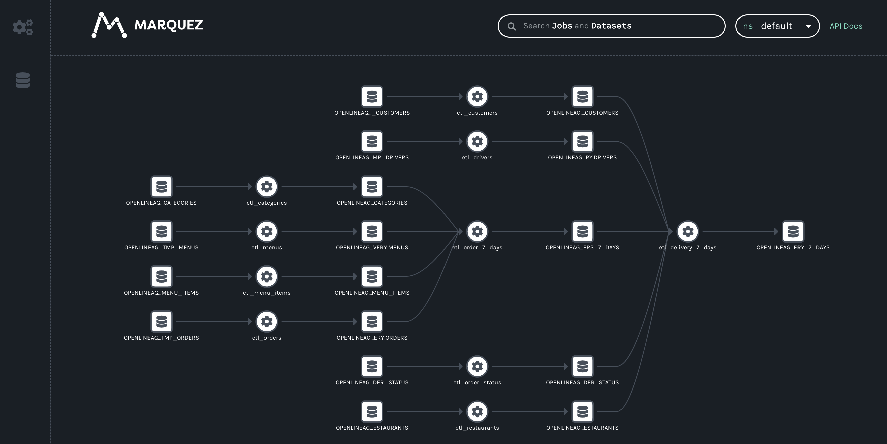

# Snowflake OpenLineage with Airflow Example

This example uses Airflow to run a collection of Snowflake queries for a fictional food delivery service. Lineage data for these queries is recorded within Snowflake [ACCESS_HISTORY](https://docs.snowflake.com/en/sql-reference/account-usage/access_history.html) and, using the OpenLineage Access History View, emitted to an OpenLineage backend.

This is done using a series of DAGs in `dags/etl` that each use SnowflakeOperator to run queries, along with a DAG in `dags/lineage` that uses PythonOperator to send generated OpenLineage events to the configured backend.

## Prerequisites

### Installing Marquez

First, check out the Marquez repository:
```bash
% git clone https://github.com/MarquezProject/marquez.git
% cd marquez
```

Then, run Marquez in detached mode:
```bash
% docker/up.sh -d
%
```

### Preparing Snowflake

First, check out the OpenLineage Access History View repository:
```bash
% git clone https://github.com/Snowflake-Labs/OpenLineage-AccessHistory-Setup.git
% cd OpenLineage-AccessHistory-Setup
```

The `OPENLINEAGE` database and `FOOD_DELIVERY` schema in Snowflake need to be created to run this example. This can be done using the SnowSQL command-line tool, or by pasting the queries into a new Snowflake Worksheet. This README will include instructions using SnowSQL.

```bash
% snowsql -u <snowflake-user> -a <snowflake-account>
SnowSQL> CREATE DATABASE OPENLINEAGE;
SnowSQL> CREATE SCHEMA OPENLINEAGE.FOOD_DELIVERY;
```

The view defined in `open_lineage_access_history.sql` also needs to be created. This view represents the entries in `ACCESS_HISTORY` as specially-constructed JSON objects containing RunEvents that can be emitted to an OpenLineage backend. To create it, use SnowSQL to set the `current_organization` session variable and execute the SQL file.

```bash
SnowSQL> SET current_organization='<snowflake-organization>';
SnowSQL> USE SCHEMA OPENLINEAGE.PUBLIC;
SnowSQL> !source open_lineage_access_history.sql
```

Finally, our lineage extraction DAG relies upon a tag on the view to keep track of which lineage events have been processed. This tag needs to be initialized:

```bash
SnowSQL> CREATE TAG OL_LATEST_EVENT_TIME;
SnowSQL> ALTER VIEW OPENLINEAGE.PUBLIC.OPENLINEAGE_ACCESS_HISTORY SET TAG OL_LATEST_EVENT_TIME = '1970-01-01T00:00:00.000';
SnowSQL> !quit
%
```

## Preparing the Environment
The following environment variables need to be set in order for the query DAGs to connect to Snowflake, and so that the extraction DAG can send lineage events to your OpenLineage backend:
* SNOWFLAKE_USER
* SNOWFLAKE_PASSWORD
* SNOWFLAKE_ACCOUNT
* OPENLINEAGE_URL
* AIRFLOW_CONN_OPENLINEAGE_SNOWFLAKE

To do this, copy the `.env-example` file to `.env`, and edit it to provide the appropriate values for your environment. The variables in this file will be set for each service in the Airflow deployment.

```bash
% cd examples/airflow
% cp .env-example .env
% vi .env
```

## Preparing Airflow

Once the environment is prepared, initialize Airflow with docker-compose:
```bash
% docker-compose up airflow-init
```

This will take several minutes. When it has finished, bring up the Airflow services:
```bash
% docker-compose up
```

This will also take several minutes. Eventually, the webserver will be up at [http://localhost:8080](http://localhost:8080). Log in using the default credentials (airflow/airflow) and navigate to the DAGs page. When you see 12 DAGs in the list, you can be confident that Airflow has completed its initialization of the example.

## Running the Example

Each of the DAGs is paused by default. Enable each one, skipping the `etl_openlineage` DAG for now. They may not all run successfully on the first try, since they have interdependencies that this example leaves unmanaged.

After each DAG has completed at least one successful run, enable `etl_openlineage`. Wait for it to complete its run.

## Result

Navigate to your Marquez deployment and view the resulting lineage graph: 


